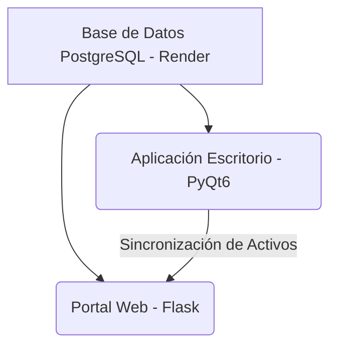

# Dashboard de Marketing e Inventario — Importadora Uziel C.A.

Este repositorio contiene la solución informática integral para la administración, control de inventarios, CRM, seguimiento de tareas, cotizaciones y control presupuestario de marketing de **Importadora Uziel C.A.**.

El sistema se compone de dos aplicaciones principales que operan sobre la misma base de datos centralizada en la nube (PostgreSQL):
1. **Aplicación de Escritorio (Desktop App)**: Desarrollada en **PyQt6** para uso local administrativo (gestión inicial del catálogo y subida masiva).
2. **Portal Web B2B (Web App)**: Desarrollada en **Flask (Python 3.11+)** y desplegada en **Render** para consulta en tiempo real, gestión remota, control de marketing, galería de imágenes y administración del sistema.

---

## 🚀 Arquitectura del Proyecto

El proyecto está diseñado bajo una arquitectura cliente-servidor unificada compartiendo la capa de datos:



- **Base de Datos**: PostgreSQL alojado en Render. Contiene toda la información de clientes, productos, usuarios, cotizaciones y logs de seguridad.
- **Sincronización DAM**: Las fotografías y recursos vinculados desde la aplicación de escritorio se suben y sincronizan automáticamente con el portal web utilizando llamadas API seguras.
- **Resiliencia de Archivos**: El servidor web cuenta con un sistema híbrido que almacena las imágenes originales en disco, pero mantiene una versión optimizada (WebP) directamente en la base de datos como respaldo automático ante reinicios de servidores efímeros.

---

## 🔒 Seguridad y Control de Acceso

La plataforma fue diseñada con un fuerte enfoque en la seguridad de la información corporativa:

- **Autenticación y Sesiones**: Acceso restringido por usuario y contraseña (hash en base de datos). Las sesiones están encriptadas mediante `FLASK_SECRET_KEY`.
- **Roles y Permisos Modulares**: El sistema maneja roles (Admin, Empleado, etc.). Cada usuario tiene permisos específicos para:
  - Leer/Modificar Clientes
  - Gestionar Productos
  - Registrar/Editar Gastos
  - Descargar Respaldos
  - Administrar Usuarios
- **Bloqueo Inteligente**: Si un usuario introduce mal su contraseña 3 veces consecutivas, su cuenta se bloquea temporalmente por 15 minutos para evitar ataques de fuerza bruta.
- **Auditoría Global (Logs)**: Cada vez que un usuario crea, edita o elimina un registro (gastos, clientes, pagos), descarga la base de datos o inicia sesión, el sistema guarda un registro permanente de "quién, qué y cuándo" en el módulo de auditoría.

---

## 👥 Administración de Usuarios

Solo los usuarios con permisos de Administrador pueden acceder a este panel, el cual permite:
- **Gestión (CRUD)**: Creación, edición (cambiar nombre de usuario, rol, permisos granulares) y eliminación o suspensión de cuentas de empleados.
- **Recuperación de Contraseñas**: Integración por correo SMTP para enviar enlaces únicos de restablecimiento de contraseña de forma segura si un usuario olvida sus credenciales.
- **Desbloqueo Manual**: Capacidad de desbloquear inmediatamente cuentas que hayan sido penalizadas por el sistema antispam.

---

## 💾 Respaldo de Base de Datos (Backups)

El sistema cuenta con un panel dedicado para la **seguridad de los datos**:
- Permite al administrador descargar en tiempo real un archivo `.sql` con el respaldo total e íntegro de la base de datos PostgreSQL.
- Evita la necesidad de ingresar a la consola del servidor u otra herramienta externa para realizar copias de seguridad críticas de los clientes, inventarios y gastos.

---

## 📦 Módulos Principales del Portal

### 👤 CRM: Gestión de Clientes y Alianzas
- **Creación de Clientes**: Registro completo de los clientes o empresas aliadas incluyendo RIF, Dirección, Teléfono, Tipo de Cliente y Correo.
- **Seguimiento (Tareas)**: Asignación de tareas internas de seguimiento a clientes con fecha límite y control de estados (Pendiente / En Proceso / Completada).
- **Alianzas Comerciales**: Generación de órdenes de entrega para material POP o donaciones de publicidad física hacia los aliados.

### 🛍️ PIM: Catálogo y Productos
- **Creación y Edición de Productos**: Permite registrar nueva mercancía, establecer su SKU, precio, categorías, compatibilidad de vehículos y marcas desde la app y la web.
- **Galería de Fotos Digital (DAM)**: Repositorio central de imágenes de repuestos.
  - Al hacer clic en un producto se muestra una **Ficha Técnica** interactiva con todas sus fotos organizadas por ángulos (Frontal, Lateral, etc.).
  - Las imágenes cuentan con un botón de retroceso inteligente que devuelve directamente a la galería o al catálogo según la procedencia del usuario.

### 📈 Presupuesto y Gastos de Marketing
Panel integral para la administración y medición del presupuesto publicitario y de recursos físicos:

- **Publicidad Digital**:
  - Registro de pautas en Meta, Google, TikTok Ads y **Linktree (Links Directos)** asociadas directamente a un Cliente de la cartera.
  - **Métricas Automáticas**: El sistema calcula de forma automática tasas clave como CTR (Tasa de Clics), CPA (Costo por Adquisición) y ROAS (Retorno de Inversión).
- **Lonas y Físicos**:
  - Registro de insumos corporativos (material POP, letreros, gorras) y servicios.
  - **Asignación de Proveedores**: Permite registrar con qué empresa externa o independiente se fabricó o imprimió el material.
  - **Gestión de Pagos (Abonos)**: Cada gasto físico permite registrar múltiples pagos (abonos parciales), llevando un historial del saldo restante, método de pago, referencia y fecha de transacción.
  - **Edición Completa**: Posibilidad de corregir cualquier error tanto en el gasto principal como en el historial de abonos en todo momento.
- **Exportación Excel Premium**:
  - Botón para descargar el reporte mensual completo en formato `.xlsx`. 
  - Genera una hoja de "Resumen" corporativa y un reporte detallado con formatos de monedas, colores automatizados y control de proveedores, ideal para enviar a gerencia.

### 📄 Cotizaciones y Ventas
- Creación rápida de cotizaciones vinculadas a clientes existentes.
- Búsqueda de productos en tiempo real e incorporación al carrito.
- Generación y descarga directa del documento de cotización formal en PDF con membrete y cálculos de IVA.

---

## 🔧 Requisitos e Instalación

### Requisitos Previos
- Python 3.11 o superior.
- PostgreSQL en la nube o local.

### Variables de Entorno (.env)
| Variable | Descripción | Valor por Defecto |
| :--- | :--- | :--- |
| `DATABASE_URL` | URL de conexión a la base de datos PostgreSQL | URL en la nube |
| `FLASK_SECRET_KEY` | Clave secreta para cifrado de sesiones web | `cambia_esta_clave_antes_de_produccion` |
| `DESKTOP_API_KEY` | Clave de seguridad para sincronización | `uziel-desktop-sync-2026` |
| `WEB_URL` | URL de producción del portal web | `https://portal-uziel-web.onrender.com` |

### Cómo Ejecutar el Portal Web Localmente
```bash
# Activa el modo debug de Flask (en Windows CMD)
set FLASK_DEBUG=1
python portal_web.py
```
Abre en tu navegador la dirección `http://localhost:5000`.

### Despliegue en Producción (Render.com)
El proyecto cuenta con la configuración necesaria para desplegarse de manera inmediata:
- **Build Command**: `pip install -r requirements.txt`
- **Start Command**: `gunicorn portal_web:app`

---

## 📄 Licencia y Créditos
Desarrollado para el uso exclusivo de **Importadora Uziel C.A.** como solución centralizada de administración y operaciones corporativas.
