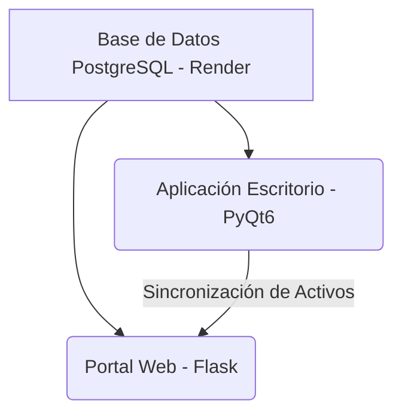

# Dashboard de Marketing e Inventario — Importadora Uziel C.A.

Este repositorio contiene la solución informática integral para la administración, control de inventarios, CRM, seguimiento de tareas, cotizaciones y control presupuestario de marketing de **Importadora Uziel C.A.**.

El sistema se compone de dos aplicaciones principales que operan sobre la misma base de datos centralizada en la nube (PostgreSQL):
1. **Aplicación de Escritorio (Desktop App)**: Desarrollada en **PyQt6** para uso local administrativo.
2. **Portal Web B2B (Web App)**: Desarrollada en **Flask (Python 3.11+)** y desplegada en **Render** para consulta en tiempo real, gestión remota, descarga de reportes y cotizaciones.

---

## 🚀 Arquitectura del Proyecto

El proyecto está diseñado bajo una arquitectura cliente-servidor unificada compartiendo la capa de datos:



- **Base de Datos**: PostgreSQL alojado en Render.
- **Sincronización DAM**: Las fotografías y recursos vinculados desde la aplicación de escritorio se suben y sincronizan automáticamente con el portal web utilizando llamadas API seguras.

---

## 📦 Requisitos de Instalación

### Requisitos Previos
- Python 3.11 o superior.
- PostgreSQL (opcional local, por defecto se conecta a la instancia en la nube configurada).

### Configuración del Entorno de Desarrollo
1. Clona o copia el directorio del proyecto en tu máquina local.
2. Crea un entorno virtual e instálalo:
   ```bash
   python -m venv venv
   # En Windows:
   .\venv\Scripts\activate
   # En Linux/Mac:
   source venv/bin/activate
   ```
3. Instala las dependencias necesarias:
   ```bash
   pip install -r requirements.txt
   ```

---

## 🛠️ Configuración de Variables de Entorno

Ambas aplicaciones leen configuraciones a través de variables de entorno (puedes definirlas en el sistema o en un archivo `.env`):

| Variable | Descripción | Valor por Defecto |
| :--- | :--- | :--- |
| `DATABASE_URL` | URL de conexión a la base de datos PostgreSQL | Configurada por defecto hacia la base de datos en la nube |
| `FLASK_SECRET_KEY` | Clave secreta para cifrado de sesiones web | `cambia_esta_clave_antes_de_produccion` |
| `DESKTOP_API_KEY` | Clave de seguridad para la sincronización de imágenes | `uziel-desktop-sync-2026` |
| `WEB_URL` | URL de producción del portal web (usado por la app de escritorio) | `https://portal-uziel-web.onrender.com` |

---

## 🖥️ 1. Aplicación de Escritorio (PyQt6)

La interfaz local de administración permite un control fluido y rápido del catálogo.

### Cómo Ejecutar
Asegúrate de tener el entorno virtual activado y ejecuta:
```bash
python main.py
```

### Módulos Incluidos
*   **Pestaña 1 — CRM (Clientes)**: Registro, visualización e historial completo de clientes.
*   **Pestaña 2 — PIM (Catálogo y Productos)**: Registro, edición y control de stock de productos. Permite realizar búsquedas inteligentes y selección múltiple de ítems para generar un catálogo de productos personalizado en formato PDF.
*   **Pestaña 3 — DAM (Activos Digitales)**: Carga y vinculación de fotografías a los productos (SKU). Convierte imágenes a WebP y las sube automáticamente al servidor web en la nube.

---

## 🌐 2. Portal Web B2B (Flask)

El portal web permite el acceso remoto seguro para el equipo de ventas, marketing y administración.

### Cómo Ejecutar Localmente
```bash
# Activa el modo debug de Flask
set FLASK_DEBUG=1
python portal_web.py
```
Abre en tu navegador la dirección `http://localhost:5000`.

### Despliegue en Producción (Render.com)
El proyecto cuenta con la configuración necesaria para desplegarse de manera inmediata:
- **Build Command**: `pip install -r requirements.txt`
- **Start Command**: `gunicorn portal_web:app`

### Módulos Principales del Portal

#### 📈 Gastos de Marketing
Panel para la administración y medición del presupuesto publicitario mensual:
- **Publicidad Digital**: Registro de pautas en Meta, Google, TikTok Ads y **Linktree (Links Directos)** asociadas directamente a un **Cliente** de la cartera.
- **Métricas de Rendimiento**: Registra Alcance, Clics, Conversiones e Ingresos. El sistema calcula de forma automática tasas clave como:
  - **CTR** (Tasa de Clics)
  - **CPA** (Costo por Adquisición)
  - **ROAS** (Retorno de Inversión Publicitaria)
- **Lonas y Físicos**: Registro de insumos corporativos (material POP, letreros, gorras) y servicios del departamento.
- **Exportación Excel Premium**: Botón para descargar el reporte mensual completo en formato `.xlsx`. Incluye:
  - Pestaña de **Resumen** diseñada como dashboard con el logotipo de la empresa y tarjetas informativas.
  - Hojas de detalle con colores corporativos, alineaciones óptimas y formatos de celda adecuados (monedas, porcentajes, etc.).

#### 📄 Cotizaciones y Ventas
- Creación rápida de cotizaciones vinculadas a clientes existentes.
- Búsqueda de productos en tiempo real e incorporación al carrito.
- Generación y descarga directa del documento de cotización formal en PDF con membrete y cálculos de IVA.

#### 📋 Tareas de Seguimiento
- Asignación de tareas internas de seguimiento a clientes con fecha límite.
- Control de estados (Pendiente / En Proceso / Completada).

#### 👥 Gestión de Usuarios y Auditoría (Solo Administrador)
- Control de cuentas, bloqueo por intentos fallidos y reseteo de contraseñas.
- Sistema de **Auditoría de Acciones**: Registro histórico de cada acción del sistema (creación de cotizaciones, descargas, registros de gastos) detallando fecha, usuario y acción realizada.
- Configuración SMTP para envío automático de correos de recuperación.

---

## 📄 Licencia y Créditos
Desarrollado para el uso exclusivo de **Importadora Uziel C.A.** como parte del sistema integrado de administración y control de marketing.
